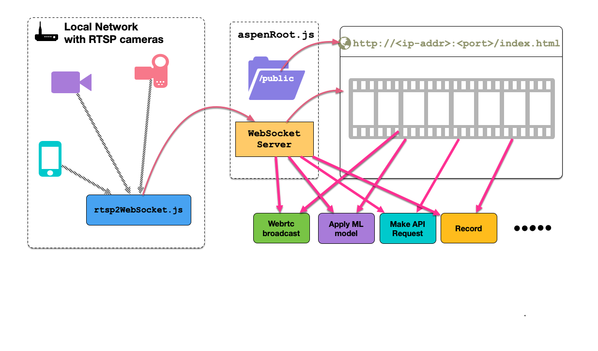

# rtsp2AIoT
Turn any rtsp stream into a websocket/webrtc stream. Run ML loads anywhere on the internet. Works on Raspberry Pi, Mac OS, Windows, Linux



## Installation

```bash
git clone https://github.com/tejaswigowda/rtsp2AIoT
cd rtsp2AIoT
npm install

```

## Usage

```bash
node rtsp2WebSocket.js <rtsp-stream-url> <broadcast IP> <broadcast Port> \
    <internalPort>(optional; default=9999) <fps>(optional/ default = 30) \
    <size>(optional;default=1920x1080)
```